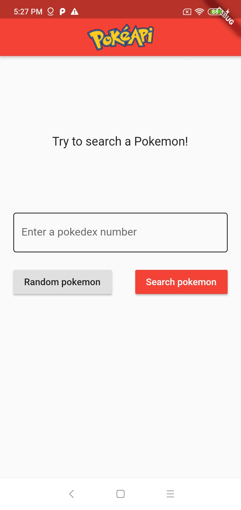
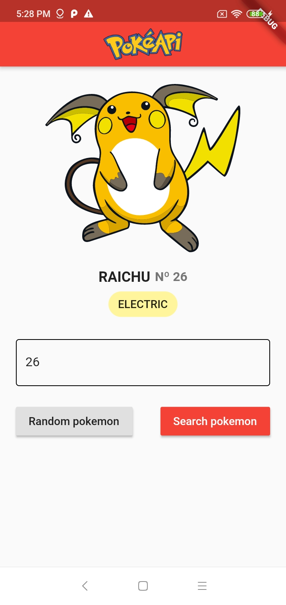
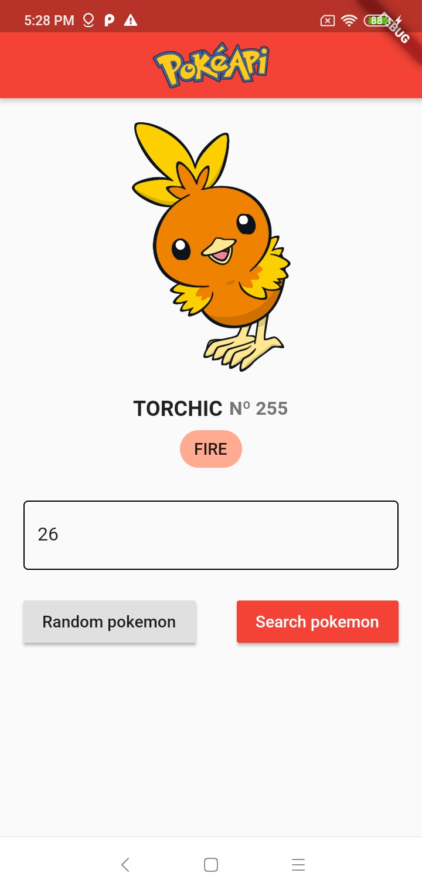
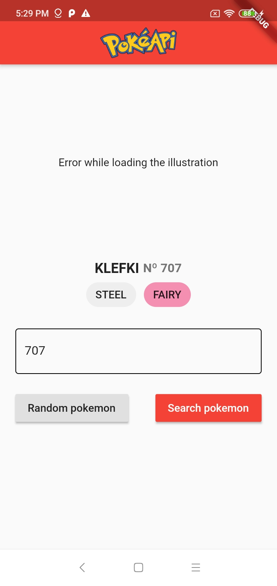

# PokeAPI App

This small application was made with Flutter SDK, PokeAPI, and ♥.

Also, I made use of Clean Architecture and BLoC pattern to ensure quality and solid code.

## Run tests
I followed TDD (Test Driven Development) practice,inside test folder there are a lot of unit tests, to run all just open a terminal in the project's root and type **flutter test test/**.

## Run app
There are not special configs to run the app, just plug a device or open a emulator and run the app.

## Screenshots

